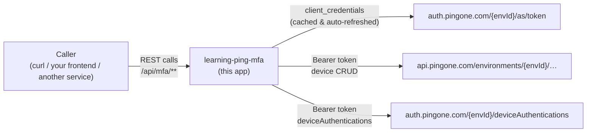
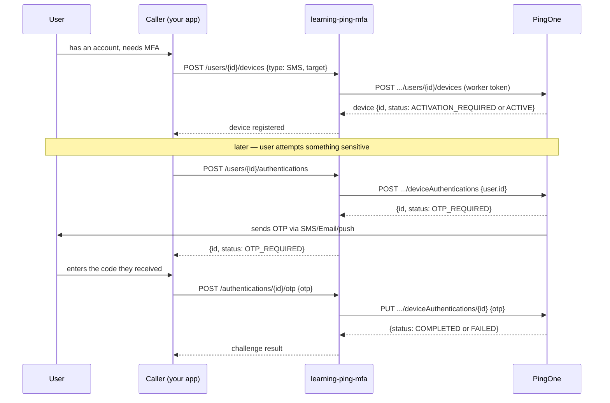

# <span style="color:hsl(204,80%,58%)">Learning PingOne MFA</span>

<p>Spring Boot 4.1 REST API demonstrating <b>PingOne MFA</b> device pairing and device-authentication (OTP) flows — worker client-credentials only, no browser login involved.</p>

## <span style="color:hsl(141,80%,58%)">Table of contents</span>

1. 🧰 [Stack](#stack)
2. 📖 [What is PingOne MFA?](#what-is-pingone-mfa)
3. 🏗️ [Architecture](#architecture)
4. 🔑 [PingOne setup (you do this once)](#pingone-setup)
5. ⚙️ [Configuration](#configuration)
6. 🚀 [Quick start](#quick-start)
7. 📡 [REST API](#rest-api)
8. 🔄 [MFA flow, end to end](#mfa-flow-end-to-end)
9. 📱 [Device pairing after app install — and where face verification fits](#device-pairing-and-face-verification)
10. 🌐 [Does MFA only work for a GUI, or can a REST API drive it?](#gui-vs-rest-api)
11. 🧪 [Testing](#testing)
12. 🔒 [Security notes](#security-notes)
13. 📚 [References](#references)

---

<a id="stack"></a>
## <span style="color:hsl(278,80%,58%)">1. 🧰 Stack</span>

| Component        | Version / Detail                                             |
|-------------------|----------------------------------------------------------------|
| Java              | 25                                                              |
| Spring Boot       | 4.1.0 (via super-pom)                                           |
| Spring Security   | OAuth2 Client — client_credentials only, no login flow          |
| HTTP client       | `RestClient` + `OAuth2ClientHttpRequestInterceptor`             |
| API docs          | springdoc-openapi (Swagger UI)                                  |
| Identity provider | PingOne (Ping Identity) — Platform API + MFA API                |
| Tests             | JUnit 5, `@WebMvcTest` + Mockito                                 |
| Build             | Maven 3.9+                                                      |

<a id="what-is-pingone-mfa"></a>
## <span style="color:hsl(56,80%,50%)">2. 📖 What is PingOne MFA?</span>

<ul>

- **PingOne** is Ping Identity's cloud IAM platform. An **environment** is your isolated tenant (users, apps, policies) inside it, identified by an `environmentId` (a UUID) — every API call is scoped to one.
- **PingOne MFA** is the multi-factor piece: it lets a *user* register one or more **devices** (SMS, Voice, Email, TOTP authenticator app, or the PingOne native mobile app for push/biometric) and then challenges those devices during a **device authentication** to prove "something you have" on top of a password.
- A **Worker application** is PingOne's term for a machine-to-machine (M2M) client — it authenticates itself with `client_id`/`client_secret` via OAuth2 `client_credentials`, gets a token, and calls the Management/MFA APIs *on behalf of* a user, server-side. That's the same client-credentials/worker/service-account pattern from general Spring Boot OAuth2-client learning, applied to a real identity provider — this repo *is* the worker.
- This is deliberately **not** an OIDC login demo (no `Authorization Code` grant, no browser redirect to PingOne's hosted login). It's the server-side half: an API that pairs devices and drives MFA challenges for users who already exist in your PingOne environment.

</ul>

<a id="architecture"></a>
## <span style="color:hsl(193,80%,58%)">3. 🏗️ Architecture</span>



<ul>

- `PingOneClientConfig` wires two `RestClient` beans — one per PingOne domain, since device CRUD lives on the **Management API** domain and device authentication lives on the **Auth API** domain (confirmed against PingOne's live API docs, 2026-09; not the same base URL).
- Both share one `OAuth2AuthorizedClientManager` doing `client_credentials` against the `pingone-worker` registration — Spring Security caches the token and re-fetches it once it expires, so `PingOneMfaClient` never touches token logic directly (`OAuth2ClientHttpRequestInterceptor` stamps every outgoing request).
- Our own `/api/mfa/**` endpoints are intentionally `permitAll()` in this demo (see [Security notes](#security-notes)) — a real deployment fronts them with its own auth.

</ul>

<a id="pingone-setup"></a>
## <span style="color:hsl(331,80%,58%)">4. 🔑 PingOne setup (you do this once)</span>

<ul>

1. Sign up for a PingOne trial / use your org's tenant at [pingidentity.com](https://www.pingidentity.com) and create (or pick) an **Environment**. Copy its **Environment ID** (a UUID, shown on the environment's dashboard).
2. **Applications → + Add Application → Worker.** This is the M2M client this app authenticates as. Note its **Client ID** and **Client Secret**.
3. Grant that Worker application the roles it needs to call the MFA API — at minimum **Identity Data Admin** (device CRUD) and the `mfa:authenticate:device` permission (device authentication). PingOne manages this under **Roles** on the application/actor.
4. **Identities → Users → + Add User** — create at least one test user, note their **User ID** (UUID). This app registers devices and drives challenges *for* that user ID.
5. **Experiences → MFA → Policies** (or your environment's default MFA policy) — make sure at least one device type (SMS/Email/TOTP) is enabled, otherwise `deviceAuthentications` has nothing to challenge against.
6. Note which **region** your environment is in — the base domains differ (`auth.pingone.com`/`api.pingone.com` for North America, `.eu` for Europe, `.asia` for APAC, `.ca` for Canada). This app defaults to the NA domains; override them in `application.yaml` if yours is elsewhere.

</ul>

<a id="configuration"></a>
## <span style="color:hsl(15,80%,58%)">5. ⚙️ Configuration</span>

All of it is environment-variable driven — nothing above goes in source control:

```bash
export PING_ENVIRONMENT_ID=your-environment-id
export PING_WORKER_CLIENT_ID=your-worker-client-id
export PING_WORKER_CLIENT_SECRET=your-worker-client-secret
```

<ul>

- `ping.environment-id`, `ping.auth-base-url`, `ping.api-base-url` — bound via `PingOneProperties` (`@ConfigurationPropertiesScan`, no `@Component`/`@EnableConfigurationProperties` boilerplate needed).
- `spring.security.oauth2.client.registration.pingone-worker.*` — the `client_credentials` registration Spring Security uses to fetch the worker token; `spring.security.oauth2.client.provider.pingone-worker.token-uri` points at `auth.pingone.com/{environmentId}/as/token`.
- See `application.yaml` for the full set and defaults.

</ul>

<a id="quick-start"></a>
## <span style="color:hsl(85,80%,50%)">6. 🚀 Quick start</span>

```bash
./mvnw spring-boot:run
# Swagger UI: http://localhost:8090/swagger-ui.html
# OpenAPI doc: http://localhost:8090/v3/api-docs
```

<a id="rest-api"></a>
## <span style="color:hsl(240,80%,58%)">7. 📡 REST API</span>

| Method | Path                                      | Purpose                                             |
|--------|--------------------------------------------|------------------------------------------------------|
| POST   | `/api/mfa/users/{userId}/devices`          | Register (pair) an SMS/Voice/Email/TOTP device       |
| GET    | `/api/mfa/users/{userId}/devices`          | List a user's registered devices                     |
| POST   | `/api/mfa/users/{userId}/authentications`  | Start an MFA challenge against the user's device      |
| POST   | `/api/mfa/authentications/{id}/otp`        | Submit the OTP to complete an `OTP_REQUIRED` challenge |

```bash
# 1. pair an SMS device
curl -s -X POST localhost:8090/api/mfa/users/$USER_ID/devices \
  -H 'Content-Type: application/json' \
  -d '{"type":"SMS","target":"+15125550000","nickname":"My phone"}'

# 2. start a challenge
curl -s -X POST localhost:8090/api/mfa/users/$USER_ID/authentications
# → {"id":"03e1897e-...","status":"OTP_REQUIRED", ...}   (PingOne texts the user a code)

# 3. complete it with the code the user received
curl -s -X POST localhost:8090/api/mfa/authentications/03e1897e-.../otp \
  -H 'Content-Type: application/json' -d '{"otp":"123456"}'
```

<a id="mfa-flow-end-to-end"></a>
## <span style="color:hsl(6,80%,58%)">8. 🔄 MFA flow, end to end</span>



<a id="device-pairing-and-face-verification"></a>
## <span style="color:hsl(320,80%,58%)">9. 📱 Device pairing after app install — and where face verification fits</span>

<ul>

- **This repo pairs "remote" devices** (SMS/Voice/Email/TOTP) the way shown above — the *server* calls `POST /devices` with a phone number or email, PingOne sends a code to prove the user actually controls it, and the device flips from `ACTIVATION_REQUIRED` to `ACTIVE`.
- **The native PingOne mobile app (push + biometric/face) pairs differently, and our API deliberately can't drive it.** Per PingOne's own docs: *"a user cannot create a native (mobile) device with `POST .../users/{userId}/devices`"* — a native device is paired with a **pairing key** instead:
    1. Server-side (this app, or the PingOne admin console) generates a **pairing key** for the user.
    2. That key is handed to the PingOne mobile app — usually via a QR code or deep link the user scans/taps right after installing the app.
    3. The app exchanges the pairing key for device credentials directly with PingOne (device-to-cloud, not through our API) and registers itself as an `ACTIVE` device tied to that user.
    4. **Face verification happens entirely on-device and inside PingOne's client SDK**, never through our REST API: the mobile app captures the face scan, does local liveness/matching against the enrolled template (or PingOne's cloud-based facial-comparison service, depending on config), and only the *result* — "user confirmed" / "user denied" — crosses the network back to PingOne as a signed assertion. Our server only ever sees a `deviceAuthentications` status flip from `PUSH_CONFIRMATION_REQUIRED` to `COMPLETED`; it never sees, stores, or verifies biometric data itself. That's by design — biometric templates never leave the device/PingOne's biometric infrastructure.
- So: the OTP flow this repo implements (SMS/Voice/Email/TOTP) is entirely REST-drivable start to finish. Push-with-face-verification is REST-drivable for *initiating and polling* the challenge (`deviceAuthentications` with `PUSH_CONFIRMATION_REQUIRED`), but the pairing step and the actual face capture require the native mobile SDK — there's no REST endpoint that accepts a face scan directly.

</ul>

<a id="gui-vs-rest-api"></a>
## <span style="color:hsl(48,80%,50%)">10. 🌐 Does MFA only work for a GUI, or can a REST API drive it?</span>

<ul>

- **It's REST-first, not GUI-only.** Everything this repo does — pairing an SMS/Email/TOTP device, starting a challenge, checking an OTP — is a plain HTTP call to `auth.pingone.com`/`api.pingone.com`. There's no requirement to redirect a browser anywhere for this flow; that's exactly why a headless service (a backend, a CLI, a batch job) can drive MFA the same way this app does.
- **What *does* need a client surface** is anything involving the native mobile app: push confirmation and face/biometric verification happen inside PingOne's mobile SDK, and QR-code/pairing-key device enrollment typically wants something a human can scan. But even then, the *orchestration* (create the pairing key, kick off the challenge, poll/react to status) is still REST — only the biometric capture itself needs the SDK.
- PingOne also has a separate **DaVinci / hosted sign-on** flow (redirect-based, OIDC `Authorization Code` grant) for browser login *with* MFA baked into a sign-on policy — that one genuinely is GUI-driven, because it's solving a different problem (interactive user login), not "call MFA as a headless API." This repo intentionally uses the other, REST-native surface (`deviceAuthentications`) instead, since the goal here is learning the API, not building a login page.

</ul>

<a id="testing"></a>
## <span style="color:hsl(210,80%,58%)">11. 🧪 Testing</span>

```bash
./mvnw test
```

<ul>

- `LearningPingMfaApplicationTests` — full `@SpringBootTest` context load, proves the real app (worker OAuth2 registration, both `RestClient` beans, `SecurityConfig`) wires up without a live PingOne connection — no network call happens at context-startup, only lazily on the first outbound request.
- `PingMfaControllerTest` — `@WebMvcTest` slice with `PingOneMfaClient` mocked via `@MockitoBean`, asserting our controller's JSON shape independent of PingOne being reachable.

</ul>

<a id="security-notes"></a>
## <span style="color:hsl(0,80%,58%)">12. 🔒 Security notes</span>

<ul>

- Never commit real `PING_WORKER_CLIENT_SECRET`/`PING_ENVIRONMENT_ID` values — `application.yaml` only holds `${ENV_VAR:placeholder}` defaults.
- `spring-boot-starter-oauth2-client` on the classpath auto-secures the *whole app* with a browser-login filter chain by default — `SecurityConfig` replaces that with an explicit, intentional `permitAll()` chain (see its javadoc). A real deployment must put real auth here before this API is reachable from anywhere but localhost.
- Scope the Worker application's roles to the minimum this app actually calls (`Identity Data Admin` + `mfa:authenticate:device`) — not a full admin role — the same "least privilege for a worker/service account" principle applies here as for any machine client.

</ul>

<a id="references"></a>
## <span style="color:hsl(170,80%,58%)">13. 📚 References</span>

<ul>

- [PingOne Platform API — introduction](https://developer.pingidentity.com/pingone-api/introduction.html)
- [Initialize Device Authentication](https://developer.pingidentity.com/pingone-api/mfa/mfa-authentication/mfa-device-authentications/initialize-device-authentication.html) — request/response shape used by `PingOneMfaClient.initiateDeviceAuthentication`
- [MFA Device Authentications](https://developer.pingidentity.com/pingone-api/mfa/mfa-authentication/mfa-device-authentications.html) — status values, otp.check flow
- [PingOne MFA — introduction](https://developer.pingidentity.com/pingone-api/mfa/introduction.html)
- [Getting started — create a test environment](https://developer.pingidentity.com/pingone-api/getting-started/create-a-test-environment/step-1-get-access-token.html)

</ul>
